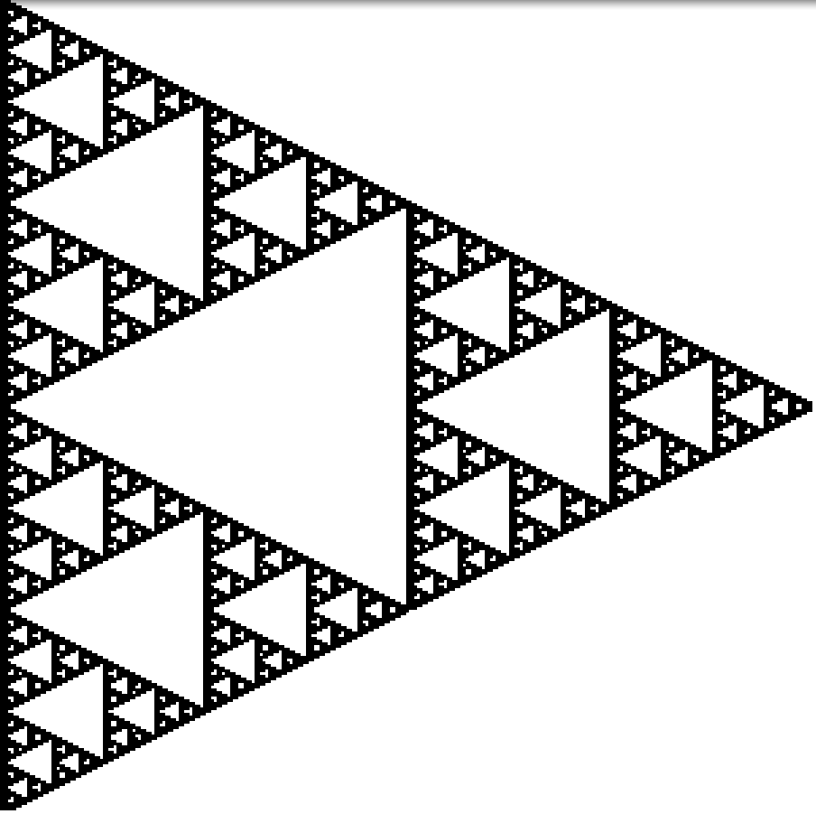

# COMP1110 Lab 8

## Before the Lab 

* Complete week 9 of your personal journal, commit and push at least 5 minutes prior to your lab.
* Make sure you've covered modules [**X01**](https://cs.anu.edu.au/courses/comp1110/lectures/javafx/#x1) and  [**X02**](https://cs.anu.edu.au/courses/comp1110/lectures/javafx/#x2) (JavaFx)

## Purpose 

In this lab you will work with a more complex object-oriented JavaFX program which has some missing components. 

## Background

Fractals are mathematical patterns composed of smaller parts where each part has the same properties as the whole.
We can create fractals by taking 'points' in a collection and applying transformations to these points (this may appear as 'scaling', 'reflecting', 'rotating' or 'translating' your points).
You will see this in action in the provided fractal program.
This program visualises an _iterated function system_ (this is not within the scope of the course), which applies a _mapping_ to each point in the fractal.
The parameters of the mappings have been provided to construct a particular fractal, the Sierpinski Triangle.

The goal of the program is to keep track of whether a grid of `Pixel`s are `ACTIVE` or `INACTIVE`.
All `Pixel`s on the grid begin as `ACTIVE`.
At each iteration of our animation, we apply each mapping to all of the `ACTIVE` points.
Each of the resulting new points from the application of the mappings become `ACTIVE`, while the point we just used becomes `INACTIVE` (unless it was mapped to from itself, in which case it should be `ACTIVE`).
After each iteration, those points which are `ACTIVE` are colored black, while those points which are `INACTIVE` are colored white.
If we repeat this process with appropriate mappings, you will see the creation of a beautiful pattern, the Sierpinski Triangle:

## Your Task
Open the provided JavaFX program `Fractals.java` and inspect the code.
There are also some supporting classes within the `comp1110.lab8` package which should be inspected.
Pay attention to:

* the use of object oriented programming features like inheritance to efficiently express the required behaviour (the nested `Pixel` class);
* the use of constants to support changes to the program parameters;
* the inclusion of comments which concisely explain what code sections are doing; and
* the use of meaningful variable names which summarise the purpose of a variable.

Once you feel that you understand the goal and structure of the code (see [Background](#background)), find the missing components of the code which are highlighted by `TODO` comments.
These `TODO` comments are ordered 1 to 6 in order of dependency.
Task 6 is the most challenging task and will require an understanding of the program components and structure.

Once you have completed the program, ensure that it generates an animation which _converges_ to the triangle fractal shown above. If it does, congratulations, otherwise, carefully check your code for possible errors and if you are stuck, talk to someone around you or your tutor for further assistance. 

Feel free to try different parameters to see what patterns you can create. You can also follow the provided pattern to add more maps or remove maps if you find an interesting fractal you would like to create. Please share any interesting fractals you created on the course Piazza forum!

## Discussion Points
* When we loop through the positions of the grid for Task 6, why is it not possible to change the `state` of this position within this same loop, that is, why is `state_out` necessary? 
* How could we determine when the image is not going to converge any further?
* Why does changing a `Pixel` in `mapping` also change the `Pixel`s which are displayed?
* Why does `Pixel` extend `Rectangle`?
* Why are the variables `state` and `color` in `Pixel` private? What could happen if we allowed _anyone_ to change these variables in any way?

## Extension Tasks
* The use of a `GridPane` makes the animation slower than it needs to be, and limits the feasible size of the fractal. Re-implement the program so it does not require a `GridPane`.
* Add a feature to create an alert window when the animation has finished. Stop the animation when this occurs.
* Streamline the process of adding and applying mappings through the use of a class `Mappings` which extends an `ArrayList<Map>`. Within this class, create some helpful methods as you see fit, a good candidate is an `applyTo` method which takes an array of `State`s and returns a new array where the states are active only if there are mapped to.
* Create, or find some more, interesting IFS (iterated function systems) fractals. Some examples are Barnsley's Fern (which requires mappings based on probability) and the golden B.

